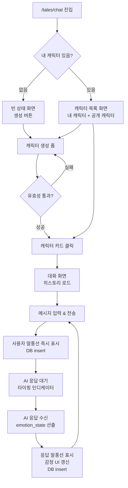

## Context

`/tales` 허브는 텍스트 기반 AI 인터랙션 공간으로 구성된 mother page다. 현재 TRPG(멀티플레이어, GM 기반)만 서비스 중이며, AI 채팅은 두 번째 서브 피처로 개발된다.

TRPG는 세션·방·GM이라는 구조적 진입 장벽이 있어, 가볍게 AI 캐릭터와 대화하고 싶은 사용자 니즈를 충족하지 못한다. AI 채팅은 별도 세션 설정 없이 바로 1:1 대화를 시작할 수 있는 경험을 목표로 한다.

- 기존 TRPG NPC 파이프라인과 독립적으로 설계한다 (재사용 없음).
- 인증 방식은 TRPG와 동일하게 `localId` (localStorage UUID) 기반 게스트 방식을 사용한다.
- 개인 프로젝트 규모로, 과도한 인프라보다 단순하고 동작하는 구현을 우선한다.

## Goals / Non-Goals

**Goals (목표):**
- 사용자가 AI 캐릭터를 직접 만들고 저장하여 재사용할 수 있다.
- 채팅 내용이 별도 저장 버튼 없이 자동 보존되며, 사용자가 삭제하기 전까지 이어진다.
- AI 캐릭터의 감정 상태가 UI에 간접적으로 드러나되, 속마음은 노출되지 않는다.
- 캐릭터가 한 개도 없는 첫 진입 시, 자연스럽게 캐릭터 생성으로 안내한다.

**Non-Goals (비목표):**
- 멀티플레이어 또는 그룹 채팅 (1:1만 지원)
- 이메일 계정 기반 인증 및 서버 측 사용자 식별
- 크로스 유저 메모리 공유 (유저마다 독립적인 대화 스레드를 가짐)
- 캐릭터 마켓플레이스 / 수익화
- 음성·이미지 생성 등 멀티모달 입출력
- TRPG NPC 파이프라인(memory-pipeline, lore-engine 등) 재사용

## Success Definition

- **첫 진입 (캐릭터 없음)**: 캐릭터 생성 후 첫 메시지 전송까지 5회 이내 조작으로 완료 가능하다.
- **재진입 (캐릭터 있음)**: 목록에서 캐릭터 선택 → 대화 화면 진입까지 2회 클릭 이내.
- 브라우저를 닫았다가 재접속해도 대화 히스토리가 그대로 복원된다.
- AI 응답이 평균 3초 이내로 도착한다 (Gemini 2.0 Flash 기준).
- 캐릭터의 감정 변화가 대화 흐름에 따라 UI에 간접적으로 반영된다 (수치 미노출).

## Requirements

**Must-have (필수):**

**M1. 캐릭터 생성/저장**
- [ ] 이름(필수), 한 줄 소개(선택), 성격 설명(필수) 입력 폼 제공
- [ ] 생성된 캐릭터는 `localId`에 귀속되어 DB에 저장
- [ ] 캐릭터 생성 완료 시 바로 해당 캐릭터와의 대화 화면으로 이동
- [ ] 캐릭터 목록 화면: 내가 만든 캐릭터 카드 목록 표시, 카드 클릭 시 대화 화면 진입
- [ ] 캐릭터 0개 빈 상태: "아직 캐릭터가 없어요" + 생성 버튼으로 안내

**M2. 대화 자동 저장 및 복원**
- [ ] 사용자 메시지 전송 시 즉시 DB insert (role: `user`)
- [ ] AI 응답 수신 완료 시 즉시 DB insert (role: `assistant`)
- [ ] 대화 화면 진입 시 해당 캐릭터의 전체 히스토리를 최신 N건 로드 (무한 스크롤 or 페이지네이션 없이 최대 100건 선 로드)
- [ ] 전송 중 / 응답 대기 중 로딩 상태 표시

**M3. 감정 상태 간접 표시**
- [ ] AI 응답 생성 시 `emotion_state: { mood, intensity }` 산출 (Gemini 응답 JSON 파트)
- [ ] `mood` 값에 따라 캐릭터 아바타 또는 UI 악센트 색상/아이콘 변화 (예: 밝음/중립/어두움)
- [ ] 수치·레이블 직접 노출 금지 — 분위기로만 체감
- [ ] 속마음(hidden inner monologue)은 DB에만 저장, UI 완전 미노출

**M4. 대화 삭제**
- [ ] 대화 화면 내 "대화 초기화" 버튼 제공
- [ ] 확인 모달 후 해당 캐릭터와의 메시지 전체 삭제 (캐릭터 자체는 유지)

**Nice-to-have (선택):**

**N1. 캐릭터 공개 전환 (public sharing)**
- [ ] 캐릭터에 `is_public` 토글 제공 — 공개 전환 시 다른 유저의 캐릭터 목록에 "공개 캐릭터" 섹션으로 노출
- [ ] 캐릭터 생성 시 `creator_bio` 필드 제공 (선택, 예: "만든 사람: uzifan, 판타지를 좋아함") — 시스템 프롬프트에 정적 주입되어 다른 유저가 제작자에 대해 물으면 답변 가능
- [ ] 각 유저는 공개 캐릭터와 완전히 독립적인 대화 스레드를 가짐 (크로스 메모리 없음)
- [ ] 공개 캐릭터의 성격/system prompt 원본은 조회 불가 (이름·소개만 노출)

**N2. 캐릭터 편집/삭제**
- [ ] 캐릭터 목록에서 편집(이름·소개·성격 수정) 및 삭제 가능 (본인 캐릭터만)
- [ ] 캐릭터 삭제 시 연관 대화 기록도 함께 삭제 (cascade)

**N3. 캐릭터 아바타**
- [ ] 텍스트 이니셜 기반 기본 아바타 (항상 표시)
- [ ] 이미지 URL 직접 입력 or 생성 기능 (낮은 우선순위)

## UX Acceptance Criteria

- **빈 상태**: 캐릭터가 0개일 때 `/tales/chat` 진입 시 "아직 캐릭터가 없어요" 메시지와 생성 버튼이 중앙에 표시된다.
- **캐릭터 목록**: 내 캐릭터와 공개 캐릭터가 섹션 구분되어 표시된다. 카드 클릭 시 해당 캐릭터와의 대화 화면으로 이동한다.
- **캐릭터 생성**: 이름(필수) + 성격 설명(필수) 입력 후 생성 시 바로 대화 화면으로 이동한다. 유효성 오류는 인라인으로 표시한다.
- **대화 화면**: 상단에 캐릭터 이름 + 감정 아이콘, 하단에 입력창. 메시지 전송 즉시 사용자 말풍선이 노출되고 AI 응답 대기 중 타이핑 인디케이터(...)가 표시된다.
- **감정 표시**: AI 응답 수신 후 캐릭터 아바타 영역의 색상/아이콘이 mood에 따라 부드럽게 전환된다. 수치나 라벨은 노출되지 않는다.
- **대화 삭제**: 대화 화면 상단 메뉴에서 "대화 초기화" 선택 → 확인 모달 → 삭제 후 빈 대화 화면 유지 (캐릭터 유지).
- **히스토리 복원**: 대화 화면 재진입 시 이전 메시지가 즉시 표시된다 (로딩 스피너 후).

## User Flows

## Wireframes

HTML 목업 파일 경로: `docs/mockups/ai-chat.html`
