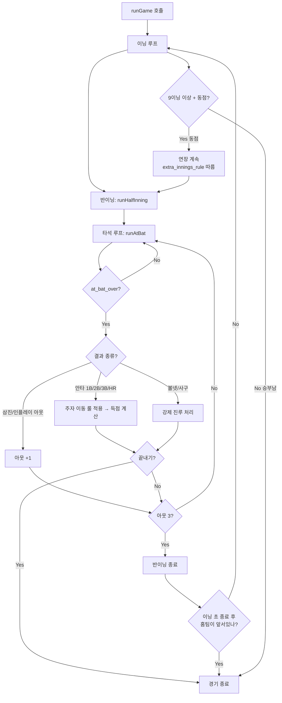

## Context

투구 엔진(`throwPitch()`)과 타격 엔진(`hitBall()`)이 완성되어 단일 투구에 대한 반응까지 처리 가능하다.
그러나 "경기"를 시뮬레이션하려면 두 엔진을 묶어 **타석 → 반이닝 → 이닝 → 경기** 단위로 반복 실행하는 루프가 필요하다.

게임 루프는 다음 레이어의 기반이 된다:
- 향후 수비 엔진(포구/송구)이 완성되면 runner-advance 룰만 교체하면 자연스럽게 연결된다.
- 향후 UI 레이어는 게임 루프가 반환하는 `GameEvent[]`를 받아 화면에 표시한다.

### 설계 원칙 참고 문서
- `docs/baseball/design/pitch-batter-interaction.md` — Section 12(주자 이동), 13(이닝/점수), 14(스태미나)
- 기존 엔진: `src/lib/baseball/engine/throw-pitch.ts`, `src/lib/baseball/batting/hit-ball.ts`

---

## Goals / Non-Goals

**Goals (MVP):**
- **G1** `runAtBat` — throwPitch + hitBall 체인으로 타석 1회 완결 (삼진/볼넷/인플레이까지)
- **G2** `runHalfInning` — 3아웃 될 때까지 타석 반복; 주자·득점 상태 관리
- **G3** `runGame` — 9이닝 완결 경기; 끝내기 처리 (연장전은 별도 기획)
- **G4** 주자 이동 MVP 룰 (고정 테이블): 수비 물리 없이 안타 종류별 진루 처리
- **G5** `simulate-game.mjs` — 박스 스코어 출력 검증 스크립트

**Non-Goals (이번에 제외):**
- 주자 물리 계산 (safe_probability, arc distance) — 수비 엔진 피처로 분리
- 수비수 포지셔닝·포구 성공 확률 — 수비 엔진 피처로 분리
- 투수 교체 (불펜 관리) — 별도 피처 (스태미나 소진 시 플래그만 발생)
- 도루, 번트, 더블플레이, 견제 — 별도 피처
- 연장전 세부 옵션 — 별도 기획 (① 무제한 / ② 12회 후 draw / ③ 10회부터 승부치기 중 선택)
- 무승부(draw) 조건 상세 — 별도 기획
- UI / API 엔드포인트 — 게임 UI 피처로 분리
- Eye 스탯 기반 선구안 개선 — 타격 엔진 v2 피처로 분리

---

## Success Definition

| 기준 | 목표 |
|------|------|
| `tsc --noEmit` 통과 | 타입 오류 0 |
| `simulate-game.mjs` 정상 실행 | 9이닝 박스 스코어 출력, 런타임 에러 없음 |
| 아웃카운트 정확성 | 매 반이닝 정확히 3아웃으로 종료 |
| 주자 이동 정확성 | 볼넷 강제진루, 안타별 진루 룰 정상 동작 |
| 끝내기 처리 | 말 이닝 역전/동점 득점 시 즉시 경기 종료 |
| 9이닝 완주 | 선공/후공 모두 정상 처리, 라인스코어 합계 일치 |

---

## Requirements

**Must-have (필수):**

- [ ] R1: **`runAtBat`** — 단일 타석 루프
  - 입력: `pitcher`, `batter`, `count`, `gameCtx` (outs, runners, inning, familiarity, stamina, recent_pitches)
  - 동작: `throwPitch → hitBall` 반복, `at_bat_over=true` 될 때까지
  - 출력: 타석 결과(`at_bat_result`), 업데이트된 stamina/familiarity, `GameEvent[]`

- [ ] R2: **`runHalfInning`** — 반이닝 루프
  - 입력: 공격 라인업, 투수, 현재 타순 인덱스, 초기 주자/득점/아웃 상태
  - 동작: `runAtBat` 반복 → 타석 결과로 주자/아웃/득점 업데이트 → 아웃 3개 시 종료
  - 출력: 득점 수, 최종 주자 상태, 소화한 타석 수, `GameEvent[]`

- [ ] R3: **`runGame`** — 경기 진행
  - 입력: 홈팀 / 원정팀 (라인업 9명 + 투수, DH 없음)
  - 타순 인계: 각 팀의 타순 인덱스는 해당 팀의 공격 반이닝 간에만 유지됨
    (원정팀: 1회 초→2회 초→... / 홈팀: 1회 말→2회 말→... — 양 팀 타순은 독립적)
  - **말 이닝 생략**: 이닝 초 종료 시점에 홈팀이 이미 앞서고 있으면 말 공격 생략 후 경기 종료
  - **끝내기**: 말 이닝 도중 홈팀이 앞서는 득점 발생 시 즉시 종료
  - **9이닝 후 동점**: 승부가 날 때까지 연장 진행 (기본값)
    - 연장 세부 옵션은 별도 기획: 무제한 연장 / 12회 후 draw / 10회부터 승부치기
    - 이번 MVP에서는 `extra_innings_rule` 파라미터로 주입 가능하게만 설계, 기본은 무제한
  - 출력: `GameResult` (최종 스코어, linescore, `winner: 'home'|'away'|'draw'`, 전체 `GameEvent[]`)

- [ ] R6: **`linescore`** — 이닝별 득점 배열
  - 형식: `{ away: number[], home: number[] }` (9이닝 각 반이닝 득점)
  - 9이닝 완주 검증에 필수 (라인스코어 합계 = 최종 스코어 일치 확인용)

- [ ] R4: **MVP 주자 이동 룰 테이블**

  | 결과 | 3루 주자 | 2루 주자 | 1루 주자 | 타자 |
  |------|---------|---------|---------|------|
  | 단타 (1B) | 홈 (득점) | 3루 | 2루 | 1루 |
  | 2루타 (2B) | 홈 (득점) | 홈 (득점) | 3루 | 2루 |
  | 3루타 (3B) | 홈 (득점) | 홈 (득점) | 홈 (득점) | 3루 |
  | 홈런 (HR) | 홈 (득점) | 홈 (득점) | 홈 (득점) | 홈 (득점) |
  | 볼넷/사구 | 유지* | 유지* | 2루* | 1루 |

  *볼넷/사구 강제 진루: 1루→2루→3루→홈 순으로 연쇄 진루 (만루 시 3루 주자 득점)

- [ ] R5: **`GameEvent[]`** — 확장 가능한 이벤트 로그
  - MVP 타입: `pitch` | `at_bat_result` | `runner_advance` | `score` | `inning_start` | `inning_end` | `game_end`
  - `game_end`에 `reason: 'normal' | 'walk_off'` 플래그 포함
  - 향후 확장 타입 (별도 피처): `error` | `double_play` | `tag_up` | `pickoff` | `pitching_change` | `stolen_base`

**Nice-to-have (선택):**
- [ ] N1: 투수 스태미나 소진 시 `stamina_warning` 이벤트 (교체 피처 전 플래그)

> **별도 기획 예정**: 게임 스탯 누적 기록 (투수 승/패/세이브, 타자 RBI/타율 등) — 계산 방법 및 DB 설계 포함하여 별도 피처로 기획

---

## UX Acceptance Criteria

*(이 피처는 순수 시뮬레이션 엔진으로 UI 없음 — Phase 3 목업 생략)*

- `simulate-game.mjs` 실행 시 박스 스코어 (라인 스코어 + 최종 스코어 + 통계) 콘솔 출력
- 끝내기 발생 시 "끝내기!" 메시지 포함
- 9회 말 종료 후 동점이면 게임 결과에 `draw` 마킹 (연장 처리 미정)

## User Flows

## Wireframes

*(UI 없음 — 해당 없음)*
