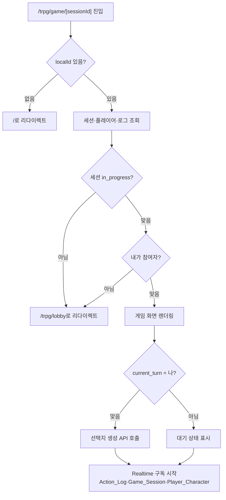
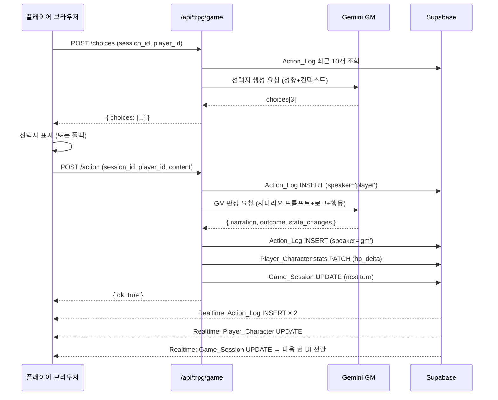
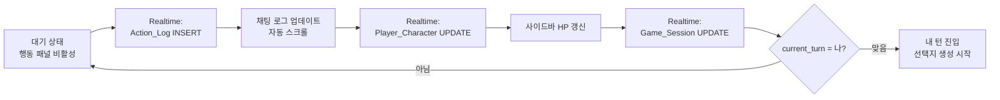
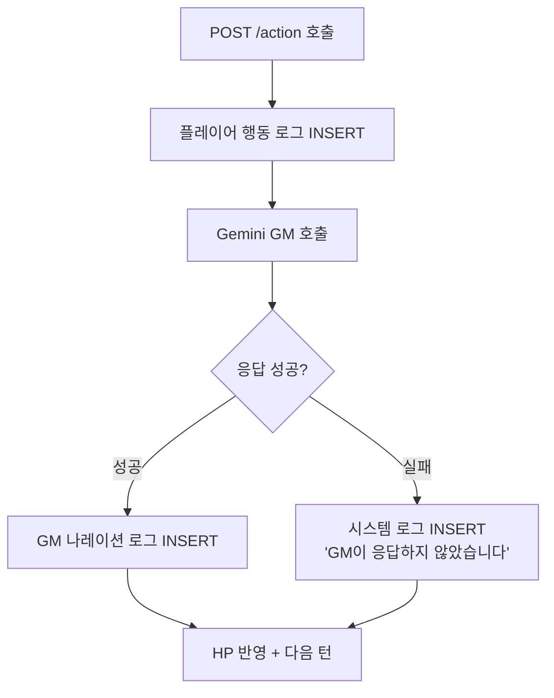

# PRD: 게임 진행 화면 & GM 에이전트

**Feature**: game-screen
**Date**: 2026-03-02
**Status**: Draft

---

## Context

### 배경
로비·대기실 기능(Phase 1)이 완료되어 플레이어들은 방을 만들고 모일 수 있다.
게임 시작 버튼을 누르면 `/trpg/game/[sessionId]`로 이동하지만, 현재 이 페이지는 빈 플레이스홀더다.

### 현재 코드 상태
- **있는 것**: Gemini 클라이언트, `runGmAction()` 스켈레톤, `runNpcDialogue()`, 타입 정의 전체, API 스텁(`/action`, `/choices`), 게임 페이지 레이아웃 뼈대
- **없는 것**: API 실제 로직, 게임 UI 컴포넌트, 실시간 채팅 로그, 턴 진행 시스템

### 사용자 페르소나
- 1~6명의 플레이어가 같은 세션에 참여, 각자 다른 브라우저(익명 게스트)를 사용
- GM은 AI(Gemini)가 담당, 별도 인간 GM 없음
- D&D에 익숙한 캐주얼~중급 TRPG 플레이어

---

## Goals

### Must-have
1. **채팅 로그**: GM 나레이션·플레이어 행동이 시간순으로 표시되며, 다른 플레이어의 행동도 실시간으로 보인다.
2. **행동 선택 패널**: 내 턴일 때 AI가 생성한 선택지 3개 + 직접 입력 필드가 표시된다.
3. **GM 판정**: 플레이어가 행동을 제출하면 Gemini GM이 시나리오 프롬프트 기반으로 결과를 판정하고 나레이션을 반환한다.
4. **HP 반영**: GM 판정 결과의 `state_changes`가 DB Player_Character의 `stats.hp`에 반영된다.
5. **턴 순환**: 한 플레이어가 행동 완료 → 다음 플레이어 턴으로 자동 이동. 선택지 3개는 **턴 시작 시** 미리 생성된다.
6. **캐릭터 상태 사이드바**: 내 HP, 직업, 아바타를 표시.
7. **플레이어 목록 사이드바**: 모든 플레이어의 이름·HP·현재 턴 여부 표시.

### Nice-to-have
- 30초 턴 타이머 (시간 초과 시 자동 스킵)
- NPC 대화 인터랙션
- 인벤토리 표시

### Non-Goals
- 캐릭터 생성 화면 (`/trpg/character/create`) — 현재 job='adventurer' 고정
- 메모리 요약(Phase 3에서 별도 진행)
- NPC 자동 생성(Phase 별도)
- 모바일 최적화
- 플레이어 연결 끊김/재접속 처리 (새로고침 시 재입장 가능, 타임아웃 자동 스킵은 Nice-to-have)
- AI 출력 품질 보증 (시나리오 프롬프트 튜닝은 별도 운영 영역)

---

## Success Definition

| 지표 | 기준 |
|------|------|
| GM 응답 시간 | 행동 제출 후 5초 이내 나레이션 표시 |
| 실시간 동기화 | 한 플레이어의 행동이 다른 브라우저에 2초 이내 반영 |
| 턴 진행 | 2인 플레이어 기준 5턴 연속 오류 없이 진행 |
| 빌드 | `npm run build` 통과, TypeScript 에러 0 |

---

## Requirements

### Must-have

#### M-1. 게임 세션 초기 로드
- 페이지 진입 시 `Game_Session`, `Player_Character[]`, `Scenario`, `Action_Log[]`(최근 30개)를 Supabase에서 조회한다.
- 세션 상태가 `in_progress`가 아니면 `/trpg/lobby`로 리다이렉트한다.
- `localId`(localStorage)로 현재 플레이어를 식별한다. 세션에 없는 사용자는 로비로 리다이렉트한다.

#### M-2. 채팅 로그 실시간 표시
- `Action_Log` 테이블의 INSERT를 Supabase Realtime으로 구독한다.
- 새 로그 항목이 추가될 때 자동으로 스크롤을 최하단으로 이동한다.
- 로그 항목은 `speaker_type`에 따라 시각적으로 구분된다:
  - `gm`: GM 나레이션 — 강조 표시 (전체 너비, 다른 배경색)
  - `player`: 플레이어 행동 — 플레이어 이름 + 아바타 색상
  - `system`: 시스템 메시지 — 중앙 정렬, 작은 텍스트
- 판정 결과(`outcome`)에 따라 결과 배지 표시: 크리티컬 성공/성공/부분 성공/실패.

#### M-3. 내 턴 진입 시 선택지 자동 생성
- 세션의 `current_turn_player_id`가 내 Player_Character ID와 일치할 때 "내 턴"이다.
- 내 턴이 되면 `POST /api/trpg/game/choices`를 자동 호출한다.
- API는 최근 Action_Log(최대 10개)와 내 캐릭터 정보(직업, personality_summary)를 Gemini에 전달해 선택지 3개를 생성한다.
- 선택지는 캐릭터 성향(personality_summary의 avatar index → 행동 스타일)을 반영한다.
- 생성 중에는 스켈레톤 로딩을 표시한다.
- Gemini 호출 실패 시 폴백 선택지 3개를 제공한다: "신중하게 접근한다", "대담하게 행동한다", "상황을 관찰한다".

#### M-4. 행동 제출
- 내 턴일 때만 행동 패널이 활성화된다 (다른 플레이어 턴에는 비활성화 + "X의 턴입니다" 표시).
- 선택지 3개 중 하나를 클릭하거나, 직접 입력 필드에 텍스트를 입력 후 제출할 수 있다.
- 제출하면 `POST /api/trpg/game/action`을 호출한다.
- 제출 후 버튼/입력 필드를 비활성화하고 "GM 판정 중…" 로딩 상태를 표시한다.

#### M-5. GM 판정 및 결과 저장
- `/api/trpg/game/action`은 다음 순서로 처리한다:
  1. 플레이어 행동을 `Action_Log`에 INSERT (speaker_type='player')
  2. Gemini GM에 시나리오 `gm_system_prompt` + 최근 로그 + 행동을 전달
  3. GM 응답(narration, outcome, state_changes)을 `Action_Log`에 INSERT (speaker_type='gm') — Gemini 호출 실패 시 "GM이 응답하지 않았습니다" 시스템 로그를 INSERT하고 턴은 넘어감
  4. `state_changes`의 hp_delta를 대상 `Player_Character.stats`에 PATCH
  5. 다음 턴 플레이어 계산 후 `Game_Session.current_turn_player_id` UPDATE

#### M-6. HP 반영
- GM이 반환한 `state_changes[].hp_delta`를 해당 Player_Character의 `stats.hp`에 누적 적용한다.
- HP는 0 미만으로 내려가지 않는다 (`max(0, hp + delta)`).
- HP 변화는 Realtime으로 Player_Character UPDATE를 구독하여 사이드바에 즉시 반영한다.

#### M-7. 턴 순환
- 턴 순서는 게임 시작 시 `Player_Character[]`의 순서대로 결정한다.
- `Game_Session.turn_order`에 Player_Character ID 배열로 저장한다.
- 현재 플레이어 행동 완료 시, 배열에서 다음 ID로 `current_turn_player_id`를 업데이트한다.
- 마지막 플레이어 다음은 첫 번째 플레이어로 순환한다 (1인 플레이 시 자기 자신으로 계속 순환).
- `Game_Session` UPDATE를 Realtime으로 구독하여 모든 클라이언트가 턴 변경을 감지한다.

#### M-8. 캐릭터 상태 사이드바
- 내 캐릭터의 아바타(색상 원), 닉네임, 직업, HP 바를 표시한다.
- HP 바는 현재/최대 HP 비율로 색상이 변한다 (초록 > 노랑 > 빨강).

#### M-9. 플레이어 목록 사이드바
- 모든 참여 플레이어의 아바타, 이름, HP를 표시한다.
- 현재 턴인 플레이어는 강조 표시(테두리, 아이콘 등)한다.
- Player_Character Realtime 구독으로 HP 변화 즉시 반영.

---

### Nice-to-have

#### N-1. 턴 타이머
- 내 턴 시작 시 30초 카운트다운을 표시한다.
- 0초가 되면 "시간 초과" 행동을 자동 제출한다.
- `Game_Session.timeout_at` 필드를 활용한다.

#### N-2. 인벤토리 패널
- 사이드바 하단에 보유 아이템 목록을 표시한다.

#### N-3. 게임 종료 처리
- `Game_Session.status`가 `completed`로 변경되면 결과 화면으로 이동한다.

---

## UX Acceptance Criteria & User Flows

### UX Acceptance Criteria

| ID | 조건 | 기대 결과 |
|----|------|-----------|
| AC-1 | 게임 화면 진입 | 3초 이내 기존 Action_Log가 채팅 로그에 표시됨 |
| AC-2 | 내 턴 감지 | current_turn_player_id = 내 ID → 행동 패널 자동 활성화, 선택지 생성 시작 |
| AC-3 | 선택지 로딩 | 생성 중 스켈레톤 3개 표시 → 완료 시 실제 선택지로 교체 |
| AC-4 | 행동 제출 | 버튼/입력 즉시 비활성화 + "GM 판정 중…" 표시 |
| AC-5 | GM 나레이션 수신 | Action_Log INSERT → 채팅 로그 최하단에 자동 추가 + 스크롤 |
| AC-6 | 타인 턴 | 행동 패널에 "○○의 턴입니다" 표시, 입력 불가 |
| AC-7 | HP 변화 | GM 판정 결과 수신 후 사이드바 HP 바 즉시 갱신 |
| AC-8 | 판정 배지 | GM 로그에 critical_success/success/partial/failure 배지 표시 |
| AC-11 | 다이스 롤 카드 | 판정 시 d20 숫자·DC·보너스·최종합을 카드로 채팅 로그에 표시 |
| AC-12 | 판정 결과 배너 | 크리티컬 성공/성공/부분 성공/실패를 색상·아이콘으로 강조 표시 |
| AC-13 | HP 변화 카드 | state_changes 발생 시 피해/회복량 + HP 바 변화를 카드로 표시 |
| AC-9 | 자동 스크롤 | 새 로그 추가 시 채팅창 최하단으로 자동 이동 |
| AC-10 | 현재 턴 강조 | 플레이어 목록에서 현재 턴 플레이어에 아이콘/테두리 강조 |

---

### User Flows

#### Flow 1: 게임 진입 & 초기 로드



#### Flow 2: 내 턴 — 행동 제출 & GM 판정



#### Flow 3: 타인 턴 — 실시간 관전



#### Flow 4: Gemini 실패 폴백



---

### 화면 레이아웃

```
┌─────────────────────────────────────────────────┬──────────────┐
│  채팅 로그 (스크롤)                              │ 내 캐릭터    │
│  ┌─────────────────────────────────────────┐    │ 🟠 아리아    │
│  │ [시스템] 게임이 시작되었습니다           │    │ 모험가       │
│  │                                         │    │ ██████░░ 73HP│
│  │ [GM] 여러분은 황금 독수리 여관에...      │    ├──────────────┤
│  │      판정: 없음                          │    │ 현재 턴      │
│  │                                         │    │ ⚔ 아리아     │
│  │ [🟠 아리아] 탑 입구를 살핀다            │    │ (나)         │
│  │                                         │    ├──────────────┤
│  │ [GM] DC 15 판정…부분 성공!              │    │ 플레이어     │
│  │      잠금장치를 발견했지만...            │    │              │
│  │      ▸ 부분 성공                        │    │ 🟠 아리아 ⚔  │
│  └─────────────────────────────────────────┘    │   HP ████ 73 │
│                                                  │              │
├─────────────────────────────────────────────────┤ 🔵 케인      │
│  행동 패널 (내 턴 활성)                          │   HP ██████  │
│  ┌──────────────┐┌──────────────┐┌────────────┐ │   100        │
│  │⚔ 신중하게    ││🏃 대담하게   ││👁 관찰한다 │ │              │
│  │  접근한다    ││  돌진한다    ││            │ │              │
│  └──────────────┘└──────────────┘└────────────┘ │              │
│  ┌────────────────────────────────────┐ ┌──────┐ │              │
│  │ 직접 입력...                        │ │ 제출 │ │              │
│  └────────────────────────────────────┘ └──────┘ │              │
└─────────────────────────────────────────────────┴──────────────┘
```

---

## Tech Spec

*(Phase 4에서 작성 예정)*

---

## Implementation Plan

### Phase A — 타입 확장 (`src/lib/types/game.ts`)

- [ ] `DiceRoll` 인터페이스 추가 (`rolled`, `modifier`, `total`, `label`)
- [ ] `HpChange` 인터페이스 추가 (`target_id`, `name`, `old_hp`, `new_hp`, `delta`)
- [ ] `GmResponse`에 `dice_roll?: DiceRoll` 필드 추가
- [ ] `RawPlayer` 인터페이스 추가 (DB 스키마 직접 매핑, MBTI 없음)
- [ ] `GameScreenState` 인터페이스 추가 (`useGameScreen` 반환 타입)

### Phase B — 백엔드

#### `src/lib/gemini/client.ts` 수정
- [ ] 기본 모델 `gemini-1.5-pro` → `gemini-2.5-flash` 변경

#### `src/lib/gemini/gm-agent.ts` 수정
- [ ] `GmActionInput` 타입 재정의: `scenarioSystemPrompt`, `fixedTruths`, `diceRoll`, `outcome` 추가, `actingPlayer: PlayerCharacter` → `RawPlayer`로 교체
- [ ] `runGmAction()`: `systemInstruction`을 `GM_SYSTEM_PROMPT` 상수 → `scenarioSystemPrompt` 파라미터로 교체
- [ ] `buildContext()`: 판정 결과(`outcome`, `diceRoll`) + `fixed_truths` 포함, `personality.mbti` 제거
- [ ] Gemini 응답 JSON 스키마에서 `outcome` 필드 제거 (서버 확정값 사용), `state_changes`는 `hp_delta` 기반으로 받아 서버에서 `HpChange`로 변환

#### `src/lib/game/choice-generator.ts` 수정
- [ ] `parseAvatarStyle(personalitySummary: string | null): string` 함수 추가
- [ ] `AVATAR_STYLE` 상수 추가 (인덱스 0~7 → 한국어 성향 스타일)
- [ ] `generateChoices()` 시그니처 변경: `personality: PersonalityProfile` → `personalitySummary: string | null, currentSituation: string, characterName: string`

#### `src/app/api/trpg/game/session/[sessionId]/route.ts` 신규
- [ ] `GET`: Game_Session + Scenario + Player_Character + Action_Log(최근 30개) 조회
- [ ] 404: 세션 없음 / 403: status가 `in_progress`가 아님

#### `src/app/api/trpg/game/choices/route.ts` 구현
- [ ] `POST`: session_id, player_id, local_id 검증
- [ ] Action_Log 최근 10개로 `currentSituation` 구성
- [ ] `parseAvatarStyle()`로 성향 스타일 추출 → Gemini 호출
- [ ] 실패 시 `FALLBACK_CHOICES` 3개 반환

#### `src/app/api/trpg/game/action/route.ts` 구현
- [ ] `POST` 7단계 파이프라인:
  - [ ] Step 1: 검증 (세션 상태, 턴 확인, 참여자 확인)
  - [ ] Step 2: d20 + `JOB_MODIFIERS` → `DiceRoll` + `outcome` 확정
  - [ ] Step 3: 플레이어 Action_Log INSERT (`state_changes: { dice_roll }`)
  - [ ] Step 4: Gemini GM 호출 (`runGmAction`)
  - [ ] Step 5: GM Action_Log INSERT (`state_changes: { hp_changes }`, Gemini `hp_delta` → `HpChange` 변환)
  - [ ] Step 6: Player_Character stats HP 업데이트
  - [ ] Step 7: 턴 전진 (`getNextTurn()`, Game_Session UPDATE)

### Phase C — 훅 (`src/hooks/useGameScreen.ts` 신규)

- [ ] 초기 로드: `GET /api/trpg/game/session/[sessionId]` → session, scenario, players, logs 세팅
- [ ] `myPlayer` 식별 (`user_id === localId`)
- [ ] 비정상 접근 리다이렉트 (세션 없음 / in_progress 아님)
- [ ] Realtime 3채널 구독:
  - [ ] `Action_Log` INSERT → logs append
  - [ ] `Game_Session` UPDATE → `current_turn_player_id` 갱신 + `isMyTurn` 변경 시 선택지 자동 생성 트리거
  - [ ] `Player_Character` UPDATE → players HP 갱신
- [ ] `submitAction(content, type)`: POST `/api/trpg/game/action`, isSubmitting 관리
- [ ] `FALLBACK_CHOICES` 상수 정의

### Phase D — UI 컴포넌트 (`src/components/trpg/game/`)

- [ ] `ChatLog.tsx`: logs 렌더링, 로그 타입별 분기 (system/player/gm), DiceRollCard, HpChangeCard, Outcome 배너 포함, 자동 스크롤
- [ ] `ActionPanel.tsx`: isMyTurn별 상태 렌더링 (로딩 스켈레톤 / 선택지 버튼 + 직접 입력 / 타인 턴 대기 / GM 판정 중 스피너)
- [ ] `CharacterStatus.tsx`: 내 캐릭터 HP바 + 스탯 사이드바 (HP 색상: ≥60% 초록 / ≥30% 노랑 / <30% 빨강)
- [ ] `PlayerList.tsx`: 전체 플레이어 목록 + 현재 턴 플레이어 강조
- [ ] `TurnIndicator.tsx`: 현재 턴 플레이어 이름 표시

### Phase E — 페이지 연결 (`src/app/trpg/game/[sessionId]/page.tsx`)

- [ ] 서버 컴포넌트 → `"use client"` 클라이언트 컴포넌트로 전환
- [ ] `localId` = `localStorage.getItem("localId")` 읽기
- [ ] `useGameScreen(sessionId, localId)` 훅 연결
- [ ] ChatLog, ActionPanel, CharacterStatus, PlayerList, TurnIndicator 배치

### Phase F — 빌드 검증

- [ ] `npm run build` 0 errors 확인
- [ ] TypeScript 타입 에러 없음 확인
- [ ] 로컬에서 1인 플레이 수동 테스트

---

### 테스트 계획

#### 기존 핵심 기능 회귀 검증
| 항목 | 방법 |
|------|------|
| 로비 방 목록 조회 | `/trpg/lobby` 정상 렌더링 확인 |
| 방 생성 + 대기실 입장 | POST `/api/trpg/sessions` → 대기실 진입 |
| 게임 시작 버튼 | `/trpg/game/[sessionId]` 리다이렉트 |

#### 신규 기능 플로우 검증
| 시나리오 | 예상 결과 |
|----------|-----------|
| 게임 화면 진입 | 채팅 로그, 선택지 3개, 사이드바 렌더링 |
| 선택지 클릭 | DiceRollCard + GM 나레이션 + HpChangeCard 순서대로 채팅 로그에 추가 |
| 자유 입력 제출 | 동일하게 판정 파이프라인 실행 |
| Gemini 호출 실패 | 시스템 메시지 로그 + 턴 자동 전진 |
| 1인 플레이 | 자신 턴 → 행동 → 선택지 재생성 반복 |
| 타인 턴 대기 | ActionPanel이 대기 상태로 전환, Realtime으로 UI 자동 갱신 |
| HP 0 도달 | HP바 빨강, delta 배지 표시 |

---

## Data Flow & Risk

### 테이블 역할 명세

| 테이블 | Read | Write |
|--------|------|-------|
| `Game_Session` | 현재 턴(`current_turn_player_id`), 턴 순서(`turn_order`), 상태(`status`) 확인 | 턴 전진 시 `current_turn_player_id`, `turn_number` 업데이트 |
| `Scenario` | `gm_system_prompt`, `fixed_truths` 조회 | 없음 (읽기 전용) |
| `Player_Character` | 플레이어 목록, `stats`(hp/max_hp), `personality_summary` 조회 | HP 변경 시 `stats.hp` 업데이트 |
| `Action_Log` | 최근 30개 (초기 로드) / 최근 10개 (Gemini context) 조회 | 플레이어 로그 + GM 나레이션 INSERT |

---

### 핵심 데이터 흐름

#### 1. 게임 화면 초기 로드

```
브라우저 진입 (/trpg/game/[sessionId])
  └─ useGameScreen(sessionId, localId)
       ├─ GET /api/trpg/game/session/[sessionId]
       │    ├─ SELECT Game_Session JOIN Scenario
       │    ├─ SELECT Player_Character WHERE session_id, is_active=true
       │    └─ SELECT Action_Log ORDER BY created_at LIMIT 30
       ├─ myPlayer = players.find(p => p.user_id === localId)
       │    └─ 미발견 시 → /trpg/lobby 리다이렉트
       ├─ Realtime 3채널 구독 시작
       └─ isMyTurn 확인 → 내 턴이면 POST /api/trpg/game/choices 호출
```

#### 2. 플레이어 행동 제출 (핵심 파이프라인)

```
ActionPanel에서 선택지 클릭 / 자유 입력 제출
  └─ submitAction(content, type)
       └─ POST /api/trpg/game/action
            │
            ├─ [Step 1: 검증]
            │    SELECT Game_Session, Player_Character
            │    session.status === 'in_progress' ✓
            │    session.current_turn_player_id === player_id ✓
            │    player.user_id === local_id ✓
            │
            ├─ [Step 2: 서버 사이드 주사위]
            │    d20 = Math.ceil(Math.random() * 20)
            │    modifier = JOB_MODIFIERS[player.job]
            │    total = d20 + modifier
            │    outcome = critical_success(total≥19 or d20=20)
            │              | success(15~18) | partial(10~14) | failure(≤9)
            │    DiceRoll = { rolled: d20, modifier, total, label: "판정" }
            │
            ├─ [Step 3: 플레이어 로그 INSERT]
            │    Action_Log {
            │      speaker_type: 'player', speaker_id: player_id
            │      action_type: 'choice' | 'free_input'
            │      content: 행동 텍스트, outcome: outcome
            │      state_changes: { dice_roll: DiceRoll }
            │    }
            │    → Realtime: 모든 클라이언트 DiceRollCard 렌더링
            │
            ├─ [Step 4: Gemini 호출]
            │    SELECT Action_Log LIMIT 10  ← 최신 context
            │    runGmAction({
            │      scenarioSystemPrompt, fixedTruths,
            │      recentLogs, actingPlayer, action,
            │      diceRoll, outcome   ← 서버 확정값
            │    })
            │    → GmRawResponse: { narration, state_changes[]{target_id, hp_delta} }
            │
            ├─ [Step 5: HP 변환 + GM 로그 INSERT]
            │    state_changes[].forEach:
            │      SELECT Player_Character WHERE id = target_id
            │      old_hp = player.stats.hp
            │      new_hp = clamp(0, max_hp, old_hp + hp_delta)
            │      HpChange = { target_id, name, old_hp, new_hp, delta: hp_delta }
            │    Action_Log {
            │      speaker_type: 'gm', speaker_name: 'GM'
            │      action_type: 'gm_narration', content: narration
            │      outcome: outcome (Step 2 확정값)
            │      state_changes: { hp_changes: HpChange[] }
            │    }
            │    → Realtime: 모든 클라이언트 GM 나레이션 + HpChangeCard 렌더링
            │
            ├─ [Step 6: HP 업데이트]
            │    HpChange[].forEach:
            │      UPDATE Player_Character SET stats.hp = new_hp WHERE id = target_id
            │    → Realtime: Player_Character UPDATE → 사이드바 HP바 갱신
            │
            └─ [Step 7: 턴 전진]
                 nextTurn = getNextTurn(session)
                 UPDATE Game_Session SET
                   current_turn_player_id = nextTurn.id,
                   turn_number = turn_number + 1
                 → Realtime: Game_Session UPDATE → 다음 플레이어 isMyTurn=true → 선택지 자동 생성
```

#### 3. Realtime 갱신 흐름

```
Supabase Realtime (postgres_changes)
  ├─ Action_Log INSERT
  │    → logs 배열 append → ChatLog 자동 스크롤
  │
  ├─ Game_Session UPDATE
  │    → session.current_turn_player_id 갱신
  │    → isMyTurn 재계산
  │    └─ isMyTurn=true → POST /api/trpg/game/choices → choices 갱신
  │
  └─ Player_Character UPDATE
       → players 배열에서 해당 player stats 갱신
       → CharacterStatus, PlayerList HP바 재렌더링
```

---

### API 명세

#### GET `/api/trpg/game/session/[sessionId]`

| 항목 | 내용 |
|------|------|
| 인증 | 없음 (Service Role Key 사용) |
| 성공 | `200` + `{ session, scenario, players, logs }` |
| 에러 | `404` 세션 없음 / `403` status가 in_progress 아님 |

#### POST `/api/trpg/game/choices`

| 항목 | 내용 |
|------|------|
| Body | `{ session_id, player_id, local_id }` |
| 성공 | `200` + `{ choices: ActionChoice[3] }` |
| Gemini 실패 | `200` + `{ choices: FALLBACK_CHOICES }` (에러 노출 안 함) |

#### POST `/api/trpg/game/action`

| 항목 | 내용 |
|------|------|
| Body | `{ session_id, player_id, local_id, action_type, content }` |
| 성공 | `200` + `{ ok: true, outcome, dice_roll }` |
| 검증 실패 | `400` / `403` + `{ error: string }` |
| Gemini 실패 | `200` + `{ ok: true }` (시스템 로그 INSERT + 턴 전진으로 처리) |

---

### Risk & Rollback

#### R1. Gemini API 호출 실패 (타임아웃 / 응답 오류 / JSON 파싱 실패)

| 구분 | 내용 |
|------|------|
| 영향 | GM 나레이션 없음, HP 변경 없음 |
| 대응 | `try/catch`로 포착 → 시스템 메시지 Action_Log INSERT ("GM이 잠시 자리를 비웠습니다.") → Step 7 턴 전진 실행 |
| 결과 | 게임 계속 진행 가능, 해당 턴만 나레이션 누락 |

#### R2. Realtime 연결 끊김

| 구분 | 내용 |
|------|------|
| 영향 | 다른 플레이어 행동/HP 변화 실시간 미반영 |
| 대응 | Supabase Realtime 자동 재연결, 재연결 성공 시 `useGameScreen` 초기 로드 재실행 |
| 미구현 | 명시적 재연결 감지 UI 없음 (Nice-to-have) |

#### R3. 중복 행동 제출 (네트워크 지연 중 더블클릭 등)

| 구분 | 내용 |
|------|------|
| 영향 | 같은 플레이어가 연속 2회 제출 시도 |
| 대응 1 | `isSubmitting` 플래그로 ActionPanel 버튼 비활성화 (클라이언트) |
| 대응 2 | Step 1 검증에서 `current_turn_player_id === player_id` 확인 → 턴이 이미 넘어간 경우 `403` 반환 (서버) |

#### R4. HP 범위 초과

| 구분 | 내용 |
|------|------|
| 영향 | Gemini가 과도한 hp_delta 반환 시 음수 HP 또는 max_hp 초과 |
| 대응 | `new_hp = Math.max(0, Math.min(max_hp, old_hp + delta))` 클램핑 처리 |

#### R5. `StateChanges` 타입 유연성

| 구분 | 내용 |
|------|------|
| 현황 | `game.ts`의 `StateChanges`가 `{ hp_delta?, target_id?, effects?, [key]: unknown }` 구조 |
| 영향 | 신규 `dice_roll`, `hp_changes` 필드 접근 시 TypeScript가 `unknown`으로 추론 |
| 대응 | ChatLog 컴포넌트에서 `(log.state_changes as { dice_roll?: DiceRoll }).dice_roll` 형태로 캐스팅 |
| 대안 | Phase A에서 `StateChanges`를 union 타입으로 교체 가능하나 기존 코드 영향 범위 고려 후 결정 |

#### 롤백 계획

- DB 스키마 변경 없음 → **코드 롤백만으로 이전 상태 복구 가능**
- 롤백 범위: `gm-agent.ts`, `choice-generator.ts`, API 3개, `useGameScreen.ts`, 5개 컴포넌트, `page.tsx`
- 기존 `game.ts` 타입은 하위 호환 방식으로 확장하므로 롤백 시 추가 필드만 제거하면 됨
