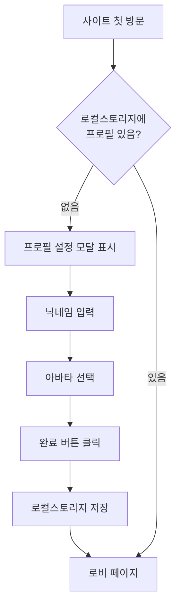
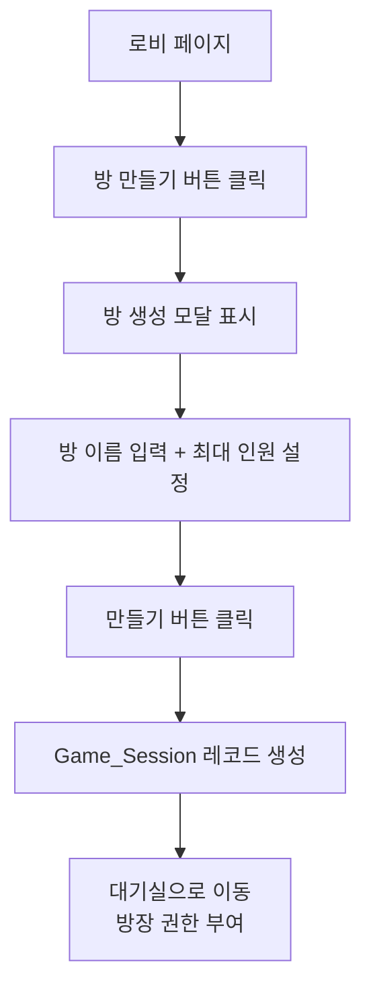
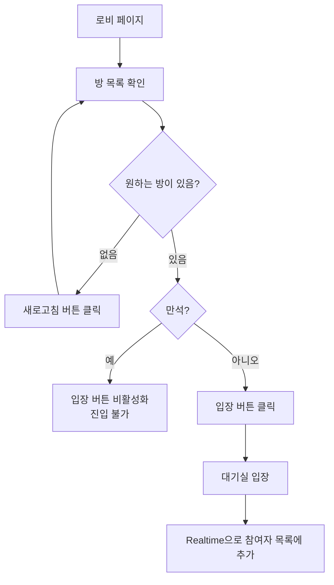
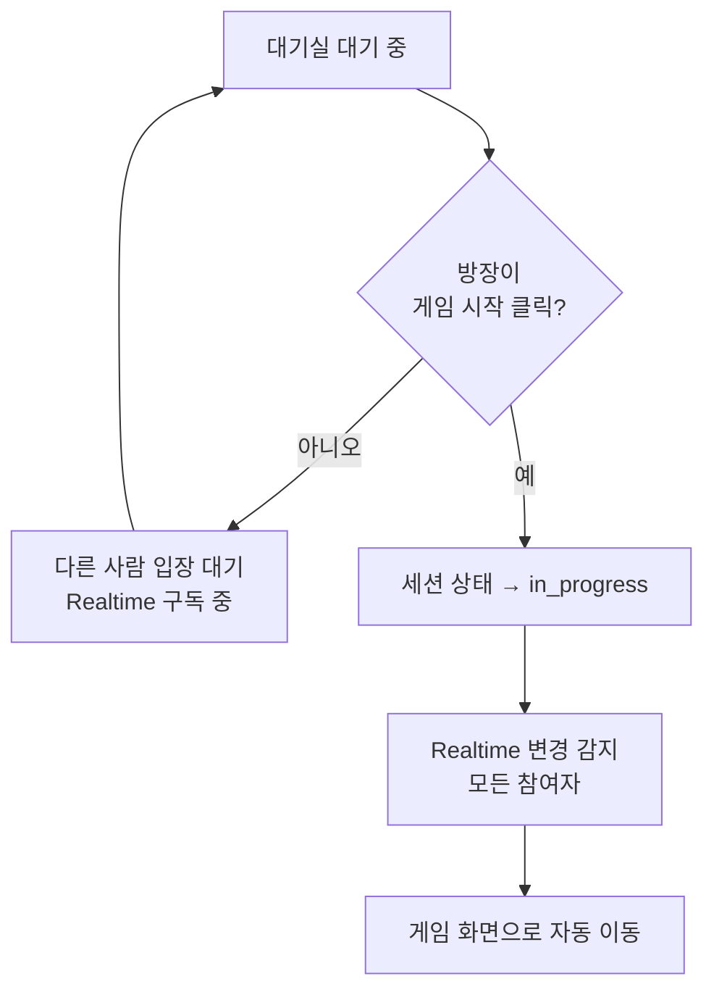

## Context

### 이 기능이 왜 필요한가?

TRPG 게임을 시작하려면 두 가지가 필요합니다.

1. **내가 누구인지** — 닉네임과 아바타
2. **어디서 만날지** — 방 목록(로비)과 대기실

이 두 가지를 이번 Phase에서 함께 만듭니다.

현재 `/trpg/lobby`, `/trpg/lobby/[방ID]` 페이지가 껍데기만 있는 상태입니다. 이번 Phase에서 실제로 동작하게 만드는 것이 목표입니다.

### 전체 서비스 접근 방식

- **계정 로그인 없음**: Playground 전체는 계정 없이 누구나 접근할 수 있습니다. 로그인 기능은 나중에 별도로 추가할 예정이며, 지금은 고려하지 않습니다.
- **게스트 프로필**: 사이트에 처음 방문하면 닉네임과 아바타를 설정합니다. 이 정보는 브라우저에 저장되어, 다음 방문 시에도 유지됩니다. (마치 쿠키 동의처럼, 처음 한 번만 설정)

### 결정 사항 정리

| 항목 | 결정 내용 | 쉬운 설명 |
|------|----------|-----------|
| **계정** | 없음 — 닉네임+아바타로 대체 | 회원가입 없이 닉네임만 입력하면 바로 사용 가능 |
| **닉네임** | 사용자가 직접 텍스트 입력 | "용사 김철수", "어둠의 마법사" 등 자유 입력 |
| **아바타** | 미리 준비된 이미지 중 선택 (임시: 색상 원 플레이스홀더) | 캐릭터 썸네일 5~10종 중 하나 클릭. 실제 이미지는 추후 교체 예정 |
| **설정 시점** | Playground 메인 페이지 첫 방문 시 | 사이트에 처음 들어오면 프로필 설정 화면이 뜸. 설정 후에는 다시 안 뜸 |
| **방 목록 갱신** | 페이지 진입 시 1회 조회 + 새로고침 버튼 | 방 목록은 자동 갱신 없음. 새 방 확인은 새로고침 버튼 클릭 |
| **대기실 갱신** | 실시간 자동 갱신 | 대기실 안에서 누군가 들어오거나 나가면 즉시 화면에 반영 |
| **기본 시나리오** | 판타지 시나리오 1개 사전 등록 | 방을 만들 때 게임 종류를 고르는데, 일단 "판타지" 1종만 제공 |

---

## Goals / Non-Goals

**Goals (이번에 만드는 것):**
- **게스트 프로필 설정**: 처음 방문 시 닉네임 입력 + 아바타 이미지 선택
- **방 만들기**: 방 이름과 최대 인원을 입력하고 방을 생성한다
- **방 찾기**: 로비에서 참여 가능한 방 목록을 보고 입장한다
- **함께 기다리기**: 대기실에서 누가 들어왔는지 실시간으로 확인하고, 방장이 게임 시작 버튼을 누르면 게임 화면으로 넘어간다

**Non-Goals (이번에 만들지 않는 것):**
- 회원가입 / 로그인
- 게임 진행 화면 (다음 Phase)
- 캐릭터 성향 테스트 및 스탯 커스터마이징 (별도 Phase)
- 방 비밀번호, 친구 초대 링크 등 고급 기능
- 아바타 직접 업로드 (선택지 중 고르는 방식만 지원)
- 실제 아바타 이미지 제작 (현재는 색상 원 플레이스홀더로 대체, 추후 교체 예정)

---

## Success Definition

아래 시나리오가 에러 없이 완주되면 성공입니다.

> 1. 사용자 A가 처음 Playground에 접속하면, 닉네임 입력 + 아바타 선택 화면이 뜬다.
> 2. A가 닉네임 "용사 김철수"와 아바타를 설정하고 저장한다.
> 3. A가 TRPG 로비로 이동해 "판타지 모험" 방을 만든다.
> 4. 사용자 B도 동일하게 프로필을 설정하고, 로비에서 그 방을 발견해 입장한다.
> 5. A의 화면에 2초 안에 B의 닉네임과 아바타가 참여자 목록에 나타난다.
> 6. 방이 꽉 차면(최대 인원 도달) 로비에서 입장 버튼이 비활성화된다.
> 7. 방장(A)이 게임 시작 버튼을 누르면 모든 참여자가 게임 화면으로 이동한다.

---

## Requirements

**Must-have (반드시 구현):**

**[게스트 프로필]**
- [ ] 로컬스토리지에 저장된 프로필이 없으면, 사이트 첫 진입 시 프로필 설정 모달을 표시한다
- [ ] 닉네임은 필수 입력 (공백 불가), 최대 12자 제한
- [ ] 아바타는 8종의 색상 원 플레이스홀더 중 1개를 반드시 선택해야 완료 가능 (기본 선택값 없음)
- [ ] 완료 후 닉네임 + 아바타 인덱스를 로컬스토리지에 저장, 이후 방문 시 모달 건너뜀

**[로비 — 방 목록]**
- [ ] `waiting` 상태 세션을 조회해 방 카드로 표시 (방 이름, 현재인원/최대인원, 참여 가능 여부)
- [ ] 만석인 방(현재인원 = 최대인원)은 입장 버튼 비활성화
- [ ] 새로고침 버튼 클릭 시 목록 재조회
- [ ] 방 만들기 버튼 클릭 시 방 생성 모달 표시

**[로비 — 방 생성]**
- [ ] 방 이름 필수 입력 (최대 20자), 최대 인원 선택 (2~7명 슬라이더)
- [ ] 생성 완료 시 `Game_Session` 레코드 생성 → 생성자를 방장으로 지정 → 대기실로 이동

**[대기실]**
- [ ] 현재 참여자 목록을 닉네임 + 아바타로 표시, 방장에게는 왕관(👑) 표시
- [ ] Supabase Realtime으로 참여자 입퇴장을 구독 → 새로고침 없이 즉시 반영
- [ ] 방장에게만 "게임 시작" 버튼 표시 (1인 시작 허용 — 혼자서도 시작 가능)
- [ ] 방장이 게임 시작 버튼 클릭 → 세션 상태를 `in_progress`로 변경 → 모든 참여자 화면이 Realtime으로 상태 변경을 감지해 자동으로 `/trpg/game/[sessionId]`로 이동

**Nice-to-have (여유 있으면 구현):**
- [ ] 프로필 수정 기능 (설정 후 닉네임/아바타 변경)
- [ ] 방장 퇴장 시 다음 입장 순서 플레이어에게 자동 위임
- [ ] 대기실 간단 채팅
- [ ] 시나리오 선택 UI (현재는 기본 판타지 시나리오 고정)

---

## UX Acceptance Criteria

**[게스트 프로필 설정 모달]**
- 닉네임 입력 필드가 자동으로 포커스된다
- 닉네임 12자 초과 입력 시 즉시 빨간 경고 메시지가 나타난다
- 아바타를 선택하기 전에는 완료 버튼이 비활성화(회색)된다
- 아바타 클릭 시 강조 테두리가 생겨 선택됐음을 표시한다
- 완료 버튼 클릭 시 모달이 닫히고 로비 페이지가 보인다
- 이후 새로고침해도 모달이 다시 뜨지 않는다

**[로비 — 방 목록]**
- 방 카드마다 방 이름, 현재인원/최대인원, 참여 가능 여부를 표시한다
- 만석(현재인원 = 최대인원)인 방의 입장 버튼은 회색(비활성화)이다
- 새로고침 버튼 클릭 시 로딩 스피너가 잠깐 표시된 뒤 목록이 갱신된다
- 방이 없을 때 "아직 열린 방이 없습니다" 안내 문구가 중앙에 표시된다

**[로비 — 방 만들기 모달]**
- 방 이름 20자 초과 시 즉시 경고 메시지가 나타난다
- 최대 인원 슬라이더는 2~7 범위이고, 현재 값이 숫자로 표시된다
- 만들기 버튼 클릭 시 즉시 대기실로 이동한다

**[대기실]**
- 입장 즉시 내 닉네임과 아바타가 참여자 목록에 표시된다
- 방장 항목 옆에 왕관(👑)이 보인다
- 다른 사람이 입장하면 새로고침 없이 2초 안에 목록에 추가된다
- 방장이 아닌 사람에게는 게임 시작 버튼이 보이지 않는다
- 방장이 게임 시작 버튼을 누르면 모든 참여자가 게임 화면으로 이동한다

---

## User Flows

### 1. 첫 방문 → 프로필 설정 → 로비 진입

### 2. 방 만들기 → 대기실

### 3. 방 찾기 → 입장 → 대기실

### 4. 대기실 → 게임 시작

---

## Wireframes

- HTML 목업 파일 경로: `docs/mockups/lobby.html`
