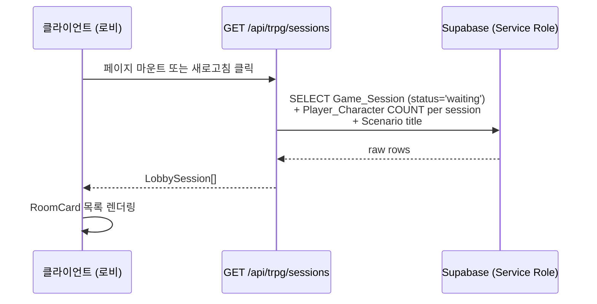
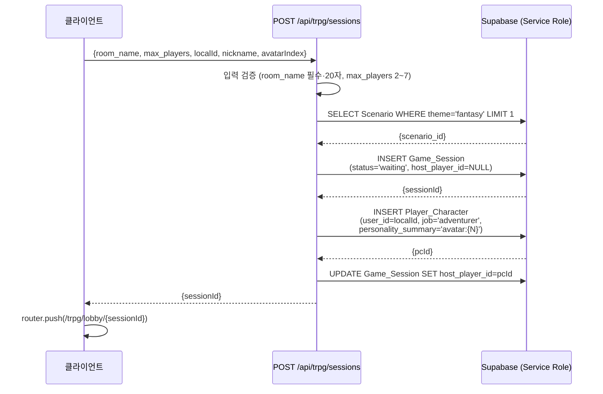
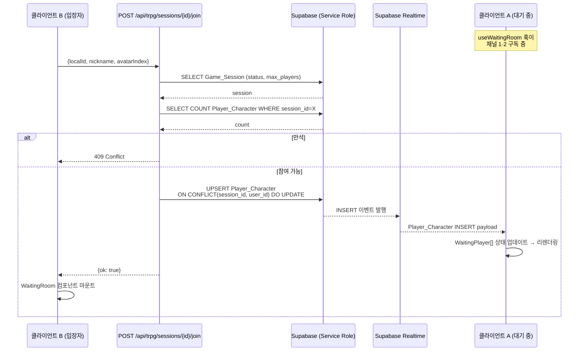
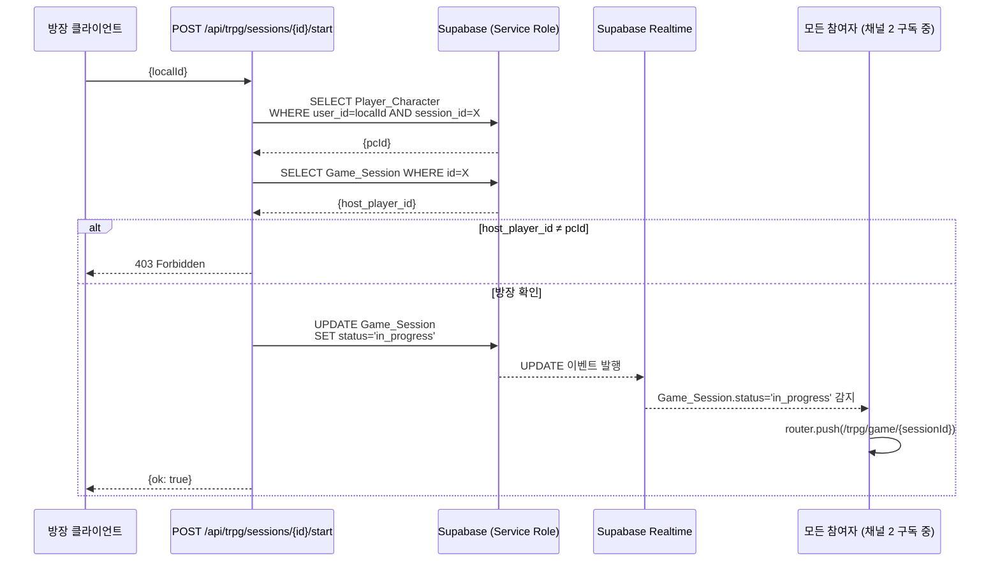

## ⚠️ 프로젝트 호환성 경고

분석 결과 **두 가지 핵심 충돌**이 발견되었습니다. 해결책을 함께 제안합니다.

### 1. RLS 정책 vs 비로그인 사용자

현재 DB 스키마에 다음 정책이 적용되어 있습니다:

```sql
-- 비로그인 사용자는 방 생성 불가
CREATE POLICY "sessions_auth_insert" ON "Game_Session"
  FOR INSERT WITH CHECK (auth.role() = 'authenticated');

-- 비로그인 사용자는 Player_Character 생성 불가
CREATE POLICY "pc_own_insert" ON "Player_Character"
  FOR INSERT WITH CHECK (auth.uid() = user_id);
```

PRD는 "계정 로그인 없음"을 명시하므로, 직접 클라이언트로 Insert하면 403이 발생합니다.

**해결책**: 모든 쓰기 작업을 Next.js API Route를 통해 **Service Role Key**로 처리합니다.
Service Role은 RLS를 완전히 우회하므로 스키마 변경 없이 해결됩니다.

### 2. Player_Character.user_id — Supabase Auth UUID 참조

`user_id UUID NOT NULL`은 원래 `auth.uid()`를 기대하는 필드입니다. 비로그인이므로 대체값이 필요합니다.

**해결책**: 첫 방문 시 `crypto.randomUUID()`로 `localId`를 생성해 localStorage에 영구 저장합니다.
이 `localId`를 `user_id`로 사용합니다. 향후 계정 로그인 기능 추가 시 `user_id`를 실제 `auth.uid()`로 마이그레이션할 수 있습니다.

---

## 의존성 분석 및 기술 설계

### API

새로 생성하는 API Route 4개:

| Method | Endpoint | 설명 |
|--------|----------|------|
| `GET` | `/api/trpg/sessions` | `waiting` 상태 세션 목록 조회 |
| `POST` | `/api/trpg/sessions` | 방 생성 (Game_Session Insert) |
| `POST` | `/api/trpg/sessions/[sessionId]/join` | 대기실 입장 (Player_Character Insert) |
| `POST` | `/api/trpg/sessions/[sessionId]/start` | 게임 시작 (status → `in_progress`) |

모든 API는 `createServiceClient()`(Service Role)를 사용하여 RLS를 우회합니다.

### DB

스키마 변경 없음. 기존 테이블을 그대로 사용합니다.

| 테이블 | 역할 | 비고 |
|--------|------|------|
| `Game_Session` | 방 목록 조회 / 방 생성 / 상태 변경 | `status: waiting → in_progress` |
| `Player_Character` | 참여자 목록 조회 / 입장 등록 | `user_id` = localStorage `localId` |
| `Scenario` | 방 생성 시 기본 시나리오 ID 조회 | 판타지 시나리오 1개 사전 등록 필요 |

**추가 필요**: `Scenario` 테이블에 기본 판타지 시나리오 시드 데이터 1건 삽입 (SQL)

### Domain

게스트 프로필은 서버와 완전히 분리된 클라이언트 전용 로직입니다:

```
localStorage['uzf_guest_profile'] = {
  nickname: string,     // 최대 12자
  avatarIndex: number,  // 0~7 (색상 원 인덱스)
  localId: string,      // crypto.randomUUID() — DB user_id로 사용
}
```

### UI

**신규 생성 컴포넌트 (4개):**

| 파일 | 설명 |
|------|------|
| `src/components/trpg/lobby/GuestProfileModal.tsx` | 닉네임 + 아바타 설정 모달 |
| `src/components/trpg/lobby/CreateRoomModal.tsx` | 방 이름 + 최대 인원 입력 모달 |
| `src/components/trpg/lobby/WaitingRoom.tsx` | 대기실 전체 UI (참여자 목록 + 사이드바) |
| `src/components/trpg/lobby/PlayerCard.tsx` | 참여자 1명 카드 (닉네임 + 아바타 + 방장 표시) |

**기존 재사용 컴포넌트:**

| 파일 | 재사용 방식 |
|------|------------|
| `src/components/ui/Modal.tsx` | `GuestProfileModal`, `CreateRoomModal`의 베이스 |
| `src/components/ui/Button.tsx` | 모든 버튼 |
| `src/components/trpg/lobby/RoomCard.tsx` | props 타입 수정 필요 (아래 설명) |

**RoomCard.tsx 수정 필요**: 현재 `GameSession & { scenario: Scenario; player_count: number }` 타입을 받지만, 로비 조회 API 응답에 맞게 타입을 조정합니다.

**수정 페이지 (2개):**

| 파일 | 변경 내용 |
|------|----------|
| `src/app/page.tsx` | `GuestProfileModal` 마운트, `useGuestProfile` 훅으로 첫 방문 감지 |
| `src/app/trpg/lobby/page.tsx` | 방 목록 fetch + 새로고침 + 방 만들기 모달 연결 |
| `src/app/trpg/lobby/[roomId]/page.tsx` | `WaitingRoom` 컴포넌트 마운트, Realtime 구독 |

**신규 훅 (2개):**

| 파일 | 설명 |
|------|------|
| `src/hooks/useGuestProfile.ts` | localStorage 읽기/쓰기/초기화 감지 |
| `src/hooks/useWaitingRoom.ts` | Player_Character Realtime 구독 + Game_Session 상태 구독 |

### Release Strategy

독립 기능 배포. 기존 게임 진행 화면(`/trpg/game/[sessionId]`)에는 영향 없음.
단, 로비에서 게임 시작 시 `/trpg/game/[sessionId]`로 이동하므로, 해당 페이지의 껍데기가 있어야 합니다 (현재 없으므로 빈 페이지 생성 필요).

---

## Plan (Implementation Checklist)

> 의존성 순서: A → (B ∥ C) → D → E
> - Phase A 완료 후 B(API)와 C(컴포넌트·훅)는 **병렬 작업 가능**
> - Phase D는 B와 C 모두 완료 후 시작

---

### Phase A: 기반 작업 (선행 조건)

> API와 컴포넌트가 의존하는 타입·훅·시드 데이터를 먼저 준비합니다.

- [ ] **[Supabase] Realtime Publication 확인**
  - Supabase 대시보드 → Database → Replication → `supabase_realtime` publication에 `Game_Session`, `Player_Character` 테이블이 포함되어 있는지 확인. 없으면 추가.

- [ ] **[Supabase] 시나리오 시드 데이터 삽입**
  - Supabase SQL 에디터에서 아래 SQL 실행:
  ```sql
  INSERT INTO "Scenario" (title, theme, description, gm_system_prompt, max_players)
  VALUES (
    '판타지의 시작',
    'fantasy',
    '용사들이 모험을 떠나는 판타지 시나리오입니다.',
    '당신은 판타지 세계의 게임 마스터입니다. 플레이어들의 행동에 맞게 이야기를 이끌어 주세요.',
    7
  );
  ```
  - 삽입 후 `SELECT id FROM "Scenario" WHERE theme = 'fantasy' LIMIT 1;` 로 ID 확인 (환경변수로 고정하거나 API에서 동적 조회)

- [ ] **[타입] `src/lib/types/lobby.ts` 작성**
  ```typescript
  export interface GuestProfile {
    nickname: string;      // 최대 12자
    avatarIndex: number;   // 0~7
    localId: string;       // crypto.randomUUID()
  }

  export interface LobbySession {
    id: string;
    room_name: string;
    max_players: number;
    player_count: number;
    scenario_title: string;
  }

  export interface WaitingPlayer {
    id: string;            // Player_Character.id
    nickname: string;      // player_name
    avatarIndex: number;   // personality_summary 파싱
    isHost: boolean;
  }
  ```

- [ ] **[훅] `src/hooks/useGuestProfile.ts` 작성**
  - `mounted` 상태로 SSR hydration mismatch 방지 (`useEffect` 내에서만 localStorage 접근)
  - `profile: GuestProfile | null` — null이면 모달 표시
  - `saveProfile(p: GuestProfile): void` — localStorage에 저장, `localId`가 없으면 `crypto.randomUUID()` 생성
  - localStorage 키: `'uzf_guest_profile'`

- [ ] **[빈 페이지] `src/app/trpg/game/[sessionId]/page.tsx` 생성**
  - 게임 시작 후 이동 대상 라우트. 이번 Phase에서는 "게임 화면 (구현 예정)" 표시만.
  - `params: Promise<{ sessionId: string }>` 타입 사용 (Next.js 16 규칙)

---

### Phase B: API Routes

> 모든 Route는 `createServiceClient()` (Service Role)를 사용합니다.
> Phase A의 타입 파일 완성 후 시작합니다.

- [ ] **`src/app/api/trpg/sessions/route.ts`**
  - `GET`: `waiting` 세션 목록 조회
    - Supabase count 쿼리 패턴:
      ```typescript
      const { data } = await supabase
        .from('Game_Session')
        .select(`id, room_name, max_players, Scenario(title), Player_Character(count)`)
        .eq('status', 'waiting');
      ```
    - 응답: `LobbySession[]`
  - `POST`: 방 생성 (3-step, 트랜잭션 없음 — 실패 시 클라이언트 에러 반환)
    - Body 검증: `room_name`(필수, 최대 20자), `max_players`(2~7), `localId`, `nickname`, `avatarIndex`
    - Step 1: `Scenario` 에서 `theme='fantasy'` 첫 번째 레코드 조회 → `scenario_id` 획득
    - Step 2: `Game_Session` Insert (host_player_id는 일단 null)
    - Step 3: `Player_Character` Insert: `job='adventurer'`, `personality_summary='avatar:{avatarIndex}'`
    - Step 4: `Game_Session` UPDATE `host_player_id = Player_Character.id`
    - 응답: `{ sessionId: string }`

- [ ] **`src/app/api/trpg/sessions/[sessionId]/join/route.ts`**
  - `POST`: 대기실 입장
    - 세션 존재 & `status='waiting'` 확인 → 없으면 404
    - 현재 `Player_Character` count 확인 → `>= max_players`이면 409
    - `Player_Character` UPSERT (ON CONFLICT session_id, user_id DO UPDATE)
    - 응답: `{ ok: true }`

- [ ] **`src/app/api/trpg/sessions/[sessionId]/start/route.ts`**
  - `POST`: 게임 시작
    - Body: `{ localId: string }`
    - `Player_Character` where `user_id=localId AND session_id=X` 조회 → id 획득
    - `Game_Session.host_player_id === Player_Character.id` 비교 → 불일치면 403
    - `Game_Session` UPDATE: `status='in_progress'`
    - 응답: `{ ok: true }`

---

### Phase C: 컴포넌트 & 훅

> Phase B API 완성 후 시작. 컴포넌트는 병렬 작업 가능.

- [ ] **`src/components/trpg/lobby/GuestProfileModal.tsx`**
  - `Modal.tsx` 래핑. `open` prop은 `useGuestProfile`의 `profile === null`로 결정 (외부에서 전달)
  - 닉네임: `<input maxLength={12}>`, 공백만 입력 시 저장 불가
  - 아바타: 8종 색상 원 (`bg-red-400` ~ `bg-pink-500` 8가지), 선택 전 완료 버튼 `disabled`
  - 완료 버튼: `saveProfile()` 호출

- [ ] **`src/components/trpg/lobby/CreateRoomModal.tsx`**
  - `Modal.tsx` 래핑
  - 방 이름: `<input maxLength={20}>`
  - 최대 인원: `<input type="range" min={2} max={7}>` + 현재 값 표시
  - 만들기 버튼: `POST /api/trpg/sessions` → 성공 시 `router.push('/trpg/lobby/{sessionId}')`

- [ ] **`src/components/trpg/lobby/PlayerCard.tsx`**
  - props: `player: WaitingPlayer`
  - 아바타 색상 원 (40px, avatarIndex → Tailwind bg 클래스 매핑)
  - 닉네임 + "방장" 태그 + 👑 이모지 (isHost일 때)

- [ ] **`src/hooks/useWaitingRoom.ts`**
  - 초기 데이터: `GET /api/trpg/sessions/[sessionId]` 또는 Supabase 직접 조회로 현재 Player_Character 목록 fetch
  - **채널 1**: `Player_Character` Realtime INSERT/DELETE WHERE `session_id=X`
    - `WaitingPlayer[]` 상태 업데이트
  - **채널 2**: `Game_Session` Realtime UPDATE WHERE `id=X`
    - `status === 'in_progress'` 감지 → `router.push('/trpg/game/{sessionId}')`
  - cleanup: 컴포넌트 언마운트 시 채널 unsubscribe
  - 반환: `{ players: WaitingPlayer[], session: LobbySession | null }`

- [ ] **`src/components/trpg/lobby/WaitingRoom.tsx`**
  - `"use client"` — Realtime 훅 사용
  - `useWaitingRoom(sessionId)` 호출
  - 좌측: `PlayerCard` 리스트 + 빈 슬롯 (max_players - players.length 개)
  - 우측 사이드바: 방 정보 + 게임 시작 버튼 (isHost일 때만 표시) + 나가기 버튼
  - 게임 시작 버튼: `POST /api/trpg/sessions/[sessionId]/start`

---

### Phase D: 페이지 연결

> Phase C 완성 후 시작. 각 페이지에 컴포넌트를 연결합니다.

- [ ] **`src/app/page.tsx` 수정**
  - `"use client"` 추가 (훅 사용)
  - `useGuestProfile()` 호출 → `profile === null && mounted`일 때 `GuestProfileModal` 렌더링

- [ ] **`src/app/trpg/lobby/page.tsx` 수정**
  - `"use client"` 추가
  - 마운트 시 `GET /api/trpg/sessions` fetch → `LobbySession[]` 상태
  - 새로고침 버튼: 로딩 상태(spinner) + 재fetch
  - 방이 없을 때 빈 상태 안내 문구
  - `CreateRoomModal` 연결 (방 만들기 버튼 클릭 시 open)
  - `RoomCard` 목록 렌더링 (만석 방 비활성화 포함)

- [ ] **`src/app/trpg/lobby/[roomId]/page.tsx` 수정**
  - `"use client"` 추가 (Realtime 훅 사용)
  - `useGuestProfile()` → 프로필 없으면 `/` 리다이렉트 (로비 직접 접근 방어)
  - 마운트 시 `POST /api/trpg/sessions/[roomId]/join` 자동 호출
  - `WaitingRoom` 컴포넌트 마운트

- [ ] **`src/components/trpg/lobby/RoomCard.tsx` 수정**
  - props 타입을 `LobbySession`으로 교체 (기존 `GameSession & { scenario; player_count }` 제거)
  - 만석 방도 카드는 표시하되 버튼 비활성화 (현재는 `!isFull`일 때만 Link 렌더링 → 버튼으로 교체)

---

### Phase E: 빌드 검증

- [ ] `npm run build` — TypeScript 에러 없이 통과
- [ ] 브라우저에서 수동 E2E 검증 (테스트 계획 항목 순서대로)

---

## 테스트 계획

**목표**: 기존 경로가 깨지지 않고, PRD User Flow 4개가 정상 동작함을 보증합니다.

### 1. Regression 검증 (빌드 완료 직후)

| # | 검증 항목 | 합격 기준 |
|---|----------|---------|
| R-1 | `npm run build` | TypeScript 에러 0개 |
| R-2 | `/trpg` 페이지 접근 | 500 에러 없이 렌더링 |
| R-3 | `/trpg/lobby` 접근 | 방 목록 또는 빈 상태 UI 렌더링 |
| R-4 | `/trpg/lobby/임의UUID` 접근 | 대기실 UI 렌더링 (세션 없어도 404 처리) |

### 2. 신규 피처 E2E 검증 (수동, 브라우저 2개 탭 사용)

**Flow 1: 첫 방문 → 프로필 설정**
- [ ] 브라우저 localStorage 초기화 → `/` 접속 → 프로필 모달이 자동으로 뜨는가?
- [ ] 닉네임 공백만 입력 → 완료 버튼이 비활성화(disabled) 상태인가?
- [ ] 아바타 미선택 → 완료 버튼이 비활성화 상태인가?
- [ ] 닉네임 + 아바타 선택 후 완료 → 모달 닫힘, localStorage에 `uzf_guest_profile` 저장 확인
- [ ] 새로고침 → 프로필 모달이 다시 뜨지 않는가?

**Flow 2: 방 만들기**
- [ ] 로비에서 "방 만들기" 클릭 → 모달 표시
- [ ] 방 이름 입력 + 최대 인원 설정 → "만들기" 클릭
- [ ] Supabase 대시보드에서 `Game_Session` 레코드 생성 확인 (`status='waiting'`)
- [ ] 대기실(`/trpg/lobby/{sessionId}`)로 자동 이동, 내 닉네임이 목록에 표시
- [ ] `Player_Character` 레코드에 `personality_summary='avatar:{n}'` 저장 확인

**Flow 3: 방 찾기 → 입장 → Realtime 동기화**
- [ ] 새 탭(사용자 B)에서 프로필 설정 후 로비 접속 → Flow 2에서 만든 방이 카드로 표시
- [ ] 입장 버튼 클릭 → 대기실 이동
- [ ] **A의 화면에 B의 닉네임이 2초 이내에 나타나는가?** (Realtime 동작 확인)
- [ ] 방을 꽉 채운 뒤 로비에서 해당 방의 입장 버튼이 비활성화되는가?

**Flow 4: 게임 시작**
- [ ] 방장(A) 화면에만 "게임 시작" 버튼이 보이는가?
- [ ] B 화면에는 "게임 시작" 버튼이 없는가?
- [ ] A가 게임 시작 클릭 → A와 B 모두 `/trpg/game/{sessionId}`로 자동 이동하는가?
- [ ] Supabase에서 `Game_Session.status = 'in_progress'` 확인

---

## 데이터 흐름 및 테이블 명세

### Flow 1: 방 목록 조회



**테이블 접근:**
- **`Game_Session`** (Read): `id, room_name, max_players, status`
- **`Player_Character`** (Read): `session_id` COUNT (is_active 무관)
- **`Scenario`** (Read): `title`

---

### Flow 2: 방 생성



**테이블 접근:**
- **`Scenario`** (Read): `id` — theme='fantasy' 첫 번째 행
- **`Game_Session`** (Write): `scenario_id, room_name, max_players, status='waiting', host_player_id`
- **`Player_Character`** (Write): `session_id, user_id, player_name, character_name, job, personality_summary`

> **⚠️ 주의**: 3-step DB 호출로 트랜잭션이 없습니다. Step 3·4 실패 시 고아 `Game_Session` 레코드가 남을 수 있습니다. 클라이언트에 에러를 반환하면 사용자가 재시도합니다.

> **⚠️ 설계 결정**: `job='adventurer'` 고정, `personality_summary='avatar:{avatarIndex}'` 형태로 아바타 인덱스 저장. `job` 필드에 임의 값을 넣으면 게임 로직(`action-resolver.ts`)에서 스탯 계산 오류 발생 가능.

---

### Flow 3: 대기실 입장 + Realtime 동기화



**테이블 접근:**
- **`Game_Session`** (Read): `status, max_players`
- **`Player_Character`** (Read): COUNT, (Write): UPSERT

**`useWaitingRoom.ts` 핵심 구현 패턴:**
```typescript
// 1. 초기 데이터 fetch (구독 시작 전 반드시 선행)
const { data: initialPlayers } = await supabase
  .from('Player_Character')
  .select('id, player_name, personality_summary')
  .eq('session_id', sessionId);
setPlayers(initialPlayers.map(parseWaitingPlayer));

// 2. 채널 1 — 참여자 변동 (INSERT / DELETE)
supabase
  .channel(`waiting-players:${sessionId}`)
  .on('postgres_changes', {
    event: '*',
    schema: 'public',
    table: 'Player_Character',
    filter: `session_id=eq.${sessionId}`
  }, (payload) => {
    if (payload.eventType === 'INSERT') {
      setPlayers(prev => [...prev, parseWaitingPlayer(payload.new)]);
    } else if (payload.eventType === 'DELETE') {
      // DELETE는 payload.old에 데이터, payload.new는 빈 객체
      setPlayers(prev => prev.filter(p => p.id !== payload.old.id));
    }
  })
  .subscribe();

// 3. 채널 2 — 세션 상태 변경 감지
supabase
  .channel(`session-status:${sessionId}`)
  .on('postgres_changes', {
    event: 'UPDATE',
    schema: 'public',
    table: 'Game_Session',
    filter: `id=eq.${sessionId}`
  }, (payload) => {
    if (payload.new.status === 'in_progress') {
      router.push(`/trpg/game/${sessionId}`);
    }
  })
  .subscribe();

// 4. personality_summary 파싱 헬퍼
function parseWaitingPlayer(row: PlayerCharacterRow): WaitingPlayer {
  const avatarIndex = parseInt(
    row.personality_summary?.replace('avatar:', '') ?? '0', 10
  );
  return {
    id: row.id,
    nickname: row.player_name,
    avatarIndex: isNaN(avatarIndex) ? 0 : avatarIndex,
    isHost: row.id === hostPcId,  // session의 host_player_id와 비교
  };
}
```

---

### Flow 4: 게임 시작



**테이블 접근:**
- **`Player_Character`** (Read): `id` — user_id=localId AND session_id=X
- **`Game_Session`** (Read): `host_player_id`, (Write): `status='in_progress'`

---

## API 명세 (확정)

### GET `/api/trpg/sessions`
- **Description**: `waiting` 상태인 세션 목록 조회
- **Response** `200`:
```json
[
  {
    "id": "uuid",
    "room_name": "판타지 대모험",
    "max_players": 4,
    "player_count": 2,
    "scenario_title": "판타지의 시작"
  }
]
```

### POST `/api/trpg/sessions`
- **Description**: 방 생성 + 방장 Player_Character 등록
- **Request Body**:
```json
{
  "room_name": "판타지 대모험",
  "max_players": 4,
  "localId": "550e8400-e29b-41d4-a716-446655440000",
  "nickname": "용사 김철수",
  "avatarIndex": 2
}
```
- **Response** `200`: `{ "sessionId": "uuid" }`
- **Error**:
  - `400`: room_name 누락 또는 유효성 실패
  - `404`: 기본 시나리오(theme='fantasy') 없음
  - `500`: DB Insert 실패

### POST `/api/trpg/sessions/[sessionId]/join`
- **Description**: 대기실 입장 (Player_Character UPSERT)
- **Request Body**: `{ "localId": "uuid", "nickname": "...", "avatarIndex": 2 }`
- **Response** `200`: `{ "ok": true }`
- **Error**:
  - `404`: 세션 없음 또는 `waiting` 상태 아님
  - `409`: 현재 인원 >= max_players (만석)

### POST `/api/trpg/sessions/[sessionId]/start`
- **Description**: 게임 시작, status → `in_progress`
- **Request Body**: `{ "localId": "uuid" }`
- **Response** `200`: `{ "ok": true }`
- **Error**:
  - `403`: localId가 host_player_id와 불일치 (방장 아님)
  - `404`: 세션 없음

---

## Risk & Rollback

| # | 리스크 | 발생 조건 | 영향도 | 대응 |
|---|--------|----------|--------|------|
| R-1 | `Scenario` 시드 없음 | 방 생성 API에서 `scenario_id` 조회 실패 | **High** — 방 생성 전면 불가 | Phase A에서 시드 SQL 먼저 실행 |
| R-2 | Realtime Publication 미설정 | `Game_Session`, `Player_Character` 테이블이 publication에 없음 | **High** — 대기실 동기화·자동 이동 불가 | Phase A에서 Supabase 대시보드 확인 |
| R-3 | 방 생성 3-step 실패 | Step 3·4 중 DB 오류 발생 | **Medium** — 고아 세션 레코드 생성 | 클라이언트 에러 반환 후 재시도. 주기적으로 `host_player_id IS NULL` 세션 정리 필요 |
| R-4 | 새로고침 시 join 중복 호출 | `[roomId]/page.tsx` 마운트 시 join 재호출 | **Low** — UPSERT라 DB 중복 없음, 불필요한 API 호출만 발생 | `useEffect`에서 이미 Player_Character 존재 시 skip |
| R-5 | localStorage 유실 (시크릿 모드·브라우저 초기화) | `localId` 분실로 재입장 불가 | **Low** — 해당 브라우저 인스턴스에서만 발생 | 새 `localId` 생성 → 새 Player_Character 등록 (같은 방 재입장 가능) |
| R-6 | 향후 auth 연동 시 `user_id` 충돌 | Supabase Auth 도입 후 `auth.uid()` ≠ `localId` | **Low (미래)** | 연동 시 `UPDATE Player_Character SET user_id=auth.uid() WHERE user_id=localId` 마이그레이션 |

**롤백 절차**:
- 이번 변경은 신규 파일(API Route + 컴포넌트 + 훅) 추가 + 기존 페이지 수정만입니다.
- 롤백 필요 시: 신규 파일 삭제 + 기존 페이지 원본 복원으로 충분합니다.
- DB 스키마 변경 없음 → 데이터 롤백 불필요.

**릴리즈 후 관찰 포인트**:
- `Game_Session` 테이블: `waiting` 상태 세션 누적량 (버려진 방 감지)
- `Game_Session` 테이블: `host_player_id IS NULL` 행 존재 시 방 생성 3-step 오류 발생 신호
- Supabase 대시보드 → Realtime → 활성 구독 수 (대기실 진입·퇴장 시 증감 확인)
